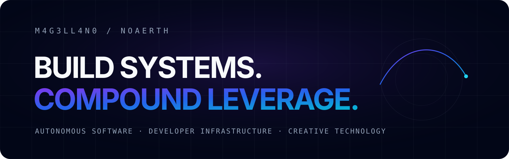

  

  <strong>Building autonomous software, developer infrastructure, venture systems, and creative technology.</strong>

  <a href="https://www.noaerth.com/">Noaerth</a> ·
  <a href="https://www.noaerth.com/portfolio">Portfolio</a> ·
  <a href="https://www.noaerth.com/labs">Labs</a>

---

## What I build

I work on systems that turn ideas into repeatable execution: software that can plan, build, verify, operate, and improve other software and products.

**Current lanes**

- **Autonomous engineering** — agent orchestration, persistent workers, model routing, approval gates
- **Developer infrastructure** — local-first tooling, deployment systems, automation, storage and workflow infrastructure
- **Venture systems** — portfolio intelligence, startup operating layers, reusable product infrastructure
- **Quant & research tooling** — evidence-driven research, evaluation, experimentation, reproducible workflows
- **Creative technology** — product design systems, interaction engines, experimental interfaces and media

## Operating principle

~~~text
idea → system → proof → release → feedback → compound
~~~

Build the smallest thing that proves the idea.  
Make the system observable.  
Automate the repeatable parts.  
Keep consequential decisions reviewable.  
Turn successful work into reusable infrastructure.

## Public surface

**Noaerth** is the public map of the broader build ecosystem—products, developer tools, research, experiments, and the operating layer connecting them.

→ **Explore:** https://www.noaerth.com/

The GitHub surface is being curated project-by-project so that public repositories are useful artifacts, not a dump of unfinished directories.

## Signal over decoration

This account is optimized for:

~~~text
working software
clear architecture
tests and verification
reproducible setup
useful documentation
real releases
real collaboration
~~~

—not artificial activity, empty commits, or badge farming.

<strong>Why are you here?</strong>

 

~~~text
WHY ARE YOU HERE?

M 4 G 3 L L 4 N 0
~~~

If you found this through a project, follow the system outward.  
If you found this by accident, explore anyway.

---

  Build systems. Prove them. Compound what works.

